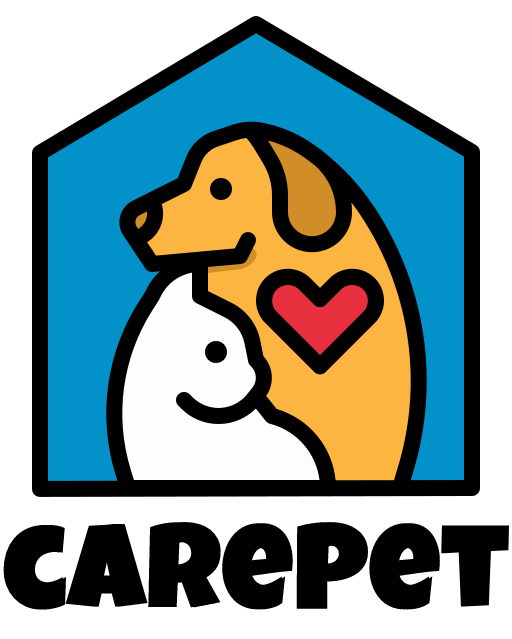

# CarePet

:information_desk_person: CarePet 소개
------------------------------
#### :bulb: 개발 목적   
* 집으로 찾아가는 훈련사 서비스

#### :moneybag: 선정 배경
  - 출처 : 1인 가구와 핵가족 증가 등 가족 형태가 변화하면서 반려동물을 키우는 인구가 늘고 있습니다.
           이 같은 반려동물 증가는 의료·금융·미용·숙박 등 다양한 분야로 확장됐습니다.
          ‘펫코노미(반려동물 산업)’라는 신조어가 이를 설명해줍니다.
          
          

#### :calendar: 개발 일정   
* 기간 : 2022년 12월 02일 ~ 2022년 12월 23일 (3주)

#### :computer: 개발 환경   
* Windows 10, 11
* Oracle 11g XE / SQL Developer 22
* HTML5 / CSS3 / JavaScript ES5 / jQuery 3 / Bootstrap 5
* STS 4.15.3 / VS Code 1.68

### :clap: Use Case Diagram 및 ERD / DB Table
---------------
:speech_balloon: ERD

### :speech_balloon:  Use Case Diagram

 

 
